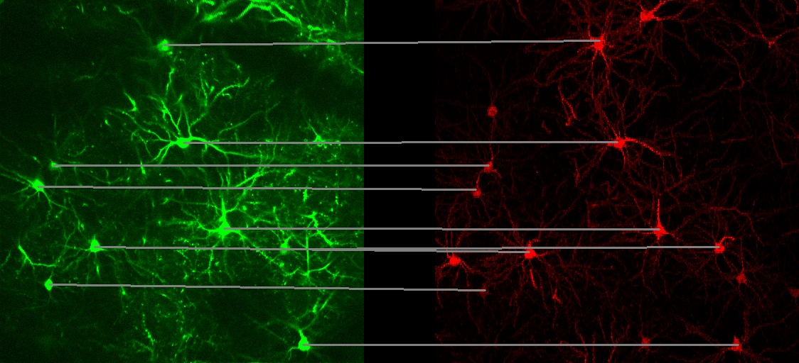

# CellGPR


We have developed a comprehensive method for automatically integrating functional imaging and structural imaging information at the single neuron level. By inputting data from two-photon calcium imaging and structural slice imaging, the system automatically generates and displays neuronal pairing results. Nine structural slice imaging datasets used for registration and verification are provided, all acquired using the HD-fMOST system with a resolution of 0.65×0.65×2μm³; the functional imaging data comes from two-photon calcium imaging, with a resolution of 1×1μm², covering 22 imaging sites located in layers L2/3 and L5 of the visual cortex. The code for automatic neuronal matching is also provided.

## Installation

We recommend using Conda to create an environment for running this program. Use the following command to create an environment:

```bash
conda create --name CellGPR python=3.11
```

Switch to the project directory:

```bash
cd CellGPR
pip install -r requirements.txt
```

We recommend using a GPU for training and detecting neurons:
```bash
conda install pytorch torchvision torchaudio pytorch-cuda=12.1 -c pytorch -c nvidia
```
For accelerated computing during neuron detection, we compile C++ dynamic libraries. On Windows systems, we recommend using MingW [Download MingW](https://www.mingw-w64.org/downloads/) to compile the files:
```
g++ -o feature.so -shared -fPIC ./Neuron_Matching/source/compute_feature.cpp
g++ -o matching.so -shared -fPIC ./Neuron_Matching/source/tensor_matching.cpp
```
Alternatively, you can use our precompiled files feature.so and matching.so. Note: You need to add the dynamic libraries to the dll_path in parameter.py and modify the variable address. The default installation path is 'C:/Program Files/Git/mingw64/bin'.

## Dataset Preparation
We provide datasets comprising nine structural slice imaging datasets and data from 22 two-photon imaging sites. You can download the datasets from the following link: [Download Datasets](http://atlas.brainsmatics.org/a/li2404).

### Directory Structure
- **2p/**: Contains two-photon imaging data and dynamically labeled cells, useful for functional analysis.
- **fMOST/**: Contains structural slice imaging data, critical for anatomical insights.
- **results/**: Contains outputs from our scripts, which display neuronal pairing relationships using connecting lines to illustrate possible neuronal connections.

## Running the Code
Place the datasets to be matched in the data directory. The parameter.py file contains parameters for neuron matching. Modify the dataset names and other parameters as needed, then run:
```bash
python run_matching.py
```
Matching results can be found at results folder. Here is an example of matching results.


